# Aviation Integrants, Reading synchro with output to Compass display

---------------------------------------------------

## Example synchro tansmitter angle measurement

angle measurement from connected synchro transmitter 
display output to NodeRed compass gauge

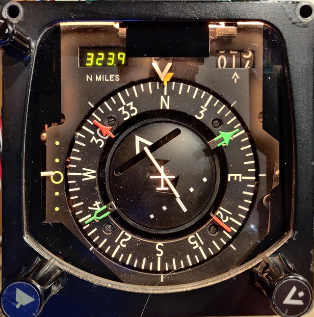

This HSI unit has a synchro transmitter output driven by the setting of the course control knob, here it is connected to the simulated synchro transformer using ADCs which is able to decode the heading angle.  

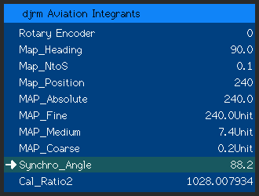

## MQTT message display

The input from the synchro ADCs appear on device 'Synchro_Angle' The angle is monitored on the LCD screen and is also available as an MQTT message.

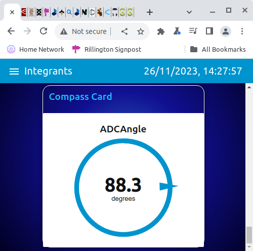

NodeRed is here configured to display the ADC angle as a dashboard compass card to follow the heading setting on the HSI.

## Synchro output configuration

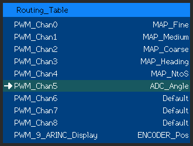

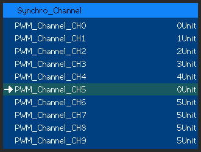

## Driving RMI instrument

The ADC input can be set as an input in the routing table for output devices, here it is used as a 400Hz synchro transmitter on output 0 to feed a RMI compass card. 

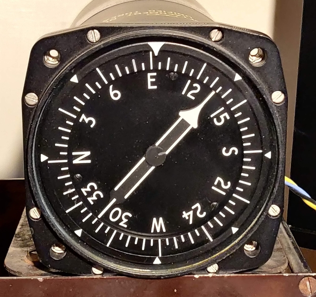

## MQTT messages from IMU 

Here the inputs are coming in from MQTT messages and feeding the pitch and roll values of a horizon display.

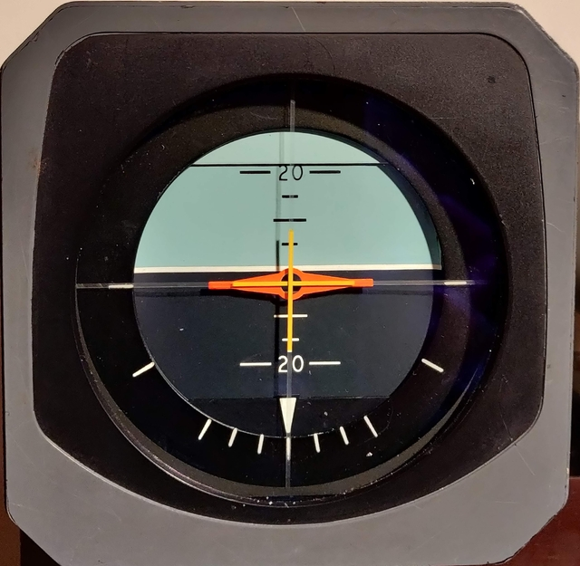

The horizon display pitch and roll inputs need synchro type signals, the sources are the MQTT messages.

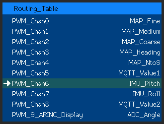

## HyperIMU Node Red flow 

The source of the data is the IMU in a mobile phone sent by wifi to Node Red

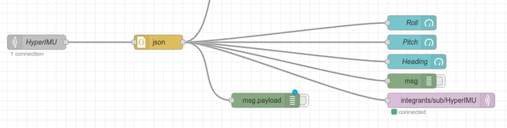

## split channel operation

One synchro simulation needs at a minimum two 400Hz signals feeding into a synchro transformer.Some simpler instruments need only one 400Hz signal of varying amplitude.

The configuration of output channel usually applies to two associated outputs but there is an option to drive just one of the outputs instead, allowing both channels of an output pair to be driven independantley.

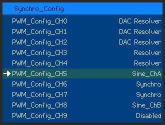
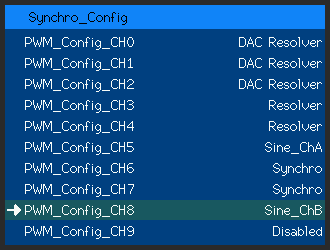

Data is again taken from MQTT messages

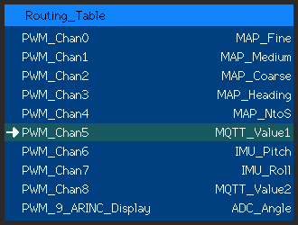
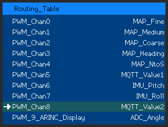

## Node Red data combining function

But this time the data is derived from two other sources using a Node Red function

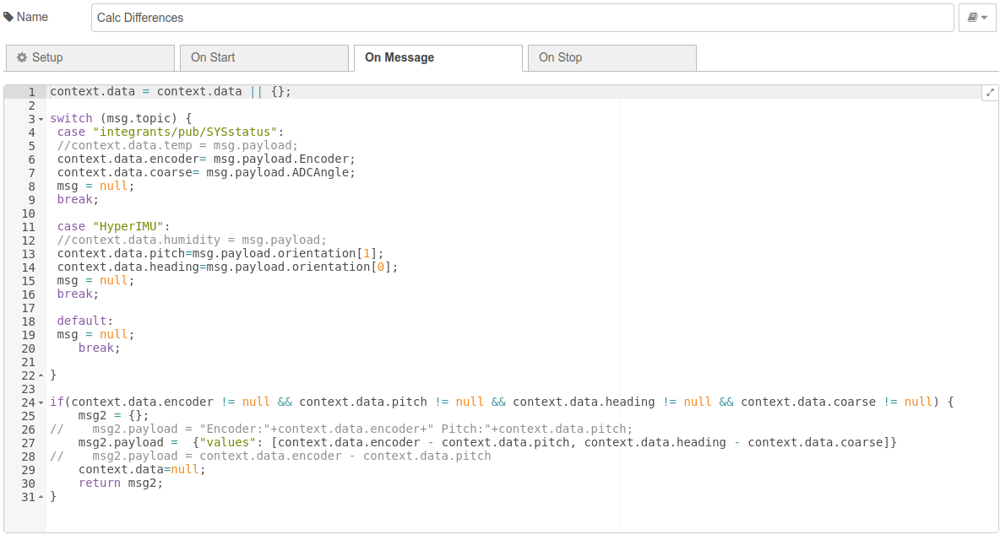

## Node Red data processing flow

This function is very simple, it subtracts the IMU pitch value from the console rotary encoder setting, and also subtracts the HSI course value from the IMU heading value. These two differences are the values fed to the Horizon horizontal and vertical cross wires.

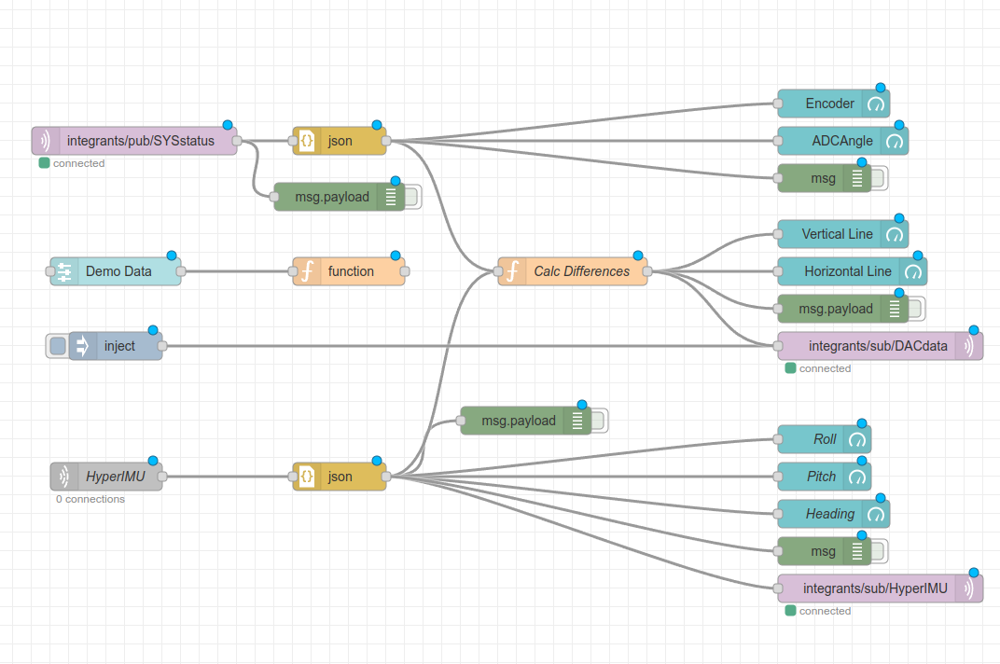

Here the two outputs are being fed to the horizontal and vertical landing course adjustment lines on the H6 horizon instrument.

## Video demonstartion

The demonstration allows an a heading, pitch, and roll to be displayed on the instruments. 
And also gives an indication on the cross wires when the heading and pitch match the values set on the control knobs.

## Conclusion

Thats all for now, next time I'll show you how the moving map is controlled using the Integrants software.
Thanks for watching, David.
