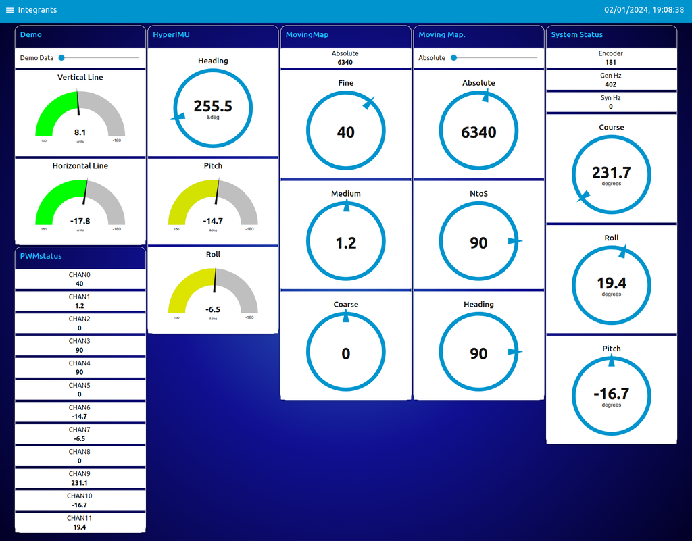
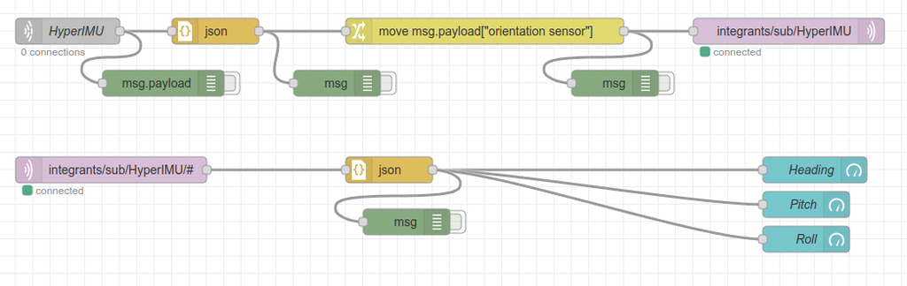
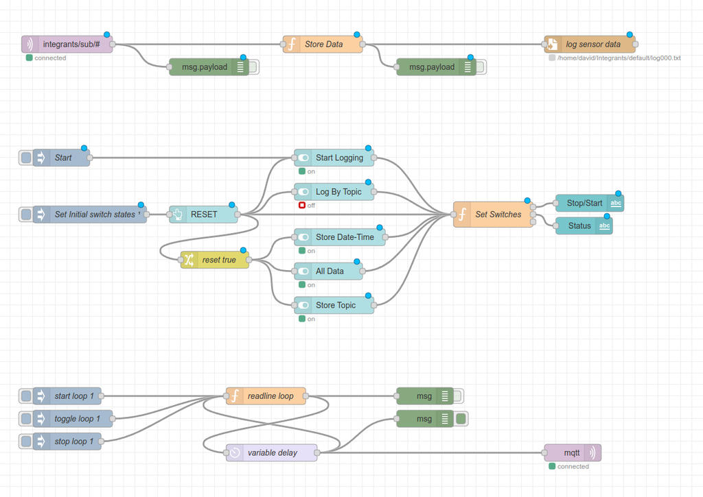

# Aviation Integrants Node-red MQTT

## MQTT topics

### Published

/Integrants/pub/SYSstatus
/Integrants/pub/PWMstatus
/Integrants/pub/MAPstatus


### Subscribed

/Integrants/sub/HyperIMU
/Integrants/sub/DACdata
/Integrants/sub/PWMdata
/Integrants/sub/DEMOdata
/Integrants/sub/MovingMap

HyperIMU phone position sensor

MovingMap Absolute value & Fine, Medium, Coarse angles

Angle inputs (0 to 4096)

Analogue inputs ( -180 to 180 )

Digital inputs ( 0 or 1 )

### JSON topics

        IMU: compass, pitch, roll
        PWMdata: angles[0 to 5]
        LEDdata: LED1, LED2, LED3, LED4, LED5, LED6, LED7, LED8
        MovingMap: Absolute, Fine, Medium, Coarse


Sample JSON formatted MQTT messages

```
Integrants
    pub
        RP2040W = RP2040W Test3
        PWMstatus = {"CHAN0": 280.0, "CHAN1": 31.0, "CHAN2": 0.9, "CHAN3": 90.0, "CHAN4": 90.0, "CHAN5": 0.0, "CHAN6": 0.0, "CHAN7": 0.0, "CHAN8": 0.0, "CHAN9": 229.9, "CHAN10": 0.0, "CHAN11": 0.0}
        SYSstatus = {"Encoder":0, "ADCAngle": 230.0, "ADC1": 1.5, "ADC2": 3.6, "Hz-gen": 402, "Hz-syn": 0}
        MAPstatus = {"Absolute":1000.000, "Fine":280.0, "Medium":31.0, "Coarse":0.9, "Heading":90.0, "NtoS":90.0}
    sub
        HyperIMU = {"os":"hyperimu","SensorAngles":[183.2643585205078,-3.753370523452759,-0.13880854845046997]}
        DACdata = {"values":[8.067283630371094,-17.834133911132824]}
        DEMOdata = {"values":[0]}
```


 * Node-red dashboard representation of Integrants pub and sub MQTT data

## Recording and playback of instrument readings.

IMU compass, pitch, roll values read from phone sensors.



 * Text version of above flow to import into node-red: [HyperIMU-MQTT json](./HyperIMU-MQTT.json)

Transferred into MQTT messages to be read by Integrants software and converted into synchro signals to drive attitude and position display modules.

Also possible to record MQTT messages to file for later or repeated playback into the Integrants software.

The recorded messages include timestamps enabling the playback to maintain the message rate of the original signals.

The recording process simply saves each wanted message to a file including its ID, Values, and timstamp. Playback reads the timestamp of sucessive messages and hold off transmission until the required messgae gap has occured.

Pitch and Roll messages are sent to the Horizon instrument, Heading messages are sent to the horizontal position compass card instrument.



 * Text version of above flow to import into node-red:
[logging-flow json](./logging-flows.json)

## resources

Tools used in the making of these flows:

[node-readlines](https://github.com/nacholibre/node-readlines)

[read file line by line](https://stevesnoderedguide.com/download/read-file-line-by-line-node-red)

[mqtt topic logger](http://www.steves-internet-guide.com/download/node-red-mqtt-data-and-topic-logger/)

[variable rate playback](https://flows.nodered.org/flow/45cd96abdf9b965ec343e4e986f17c71)


