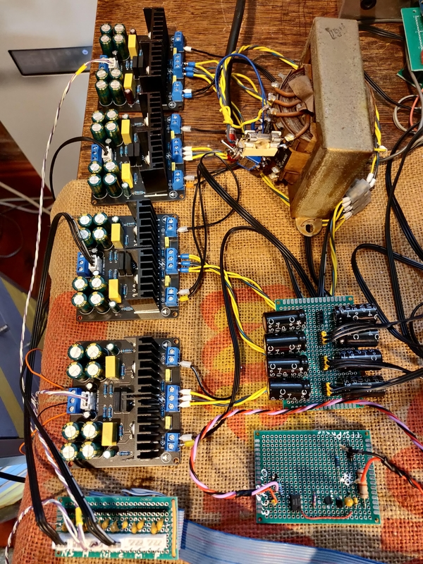
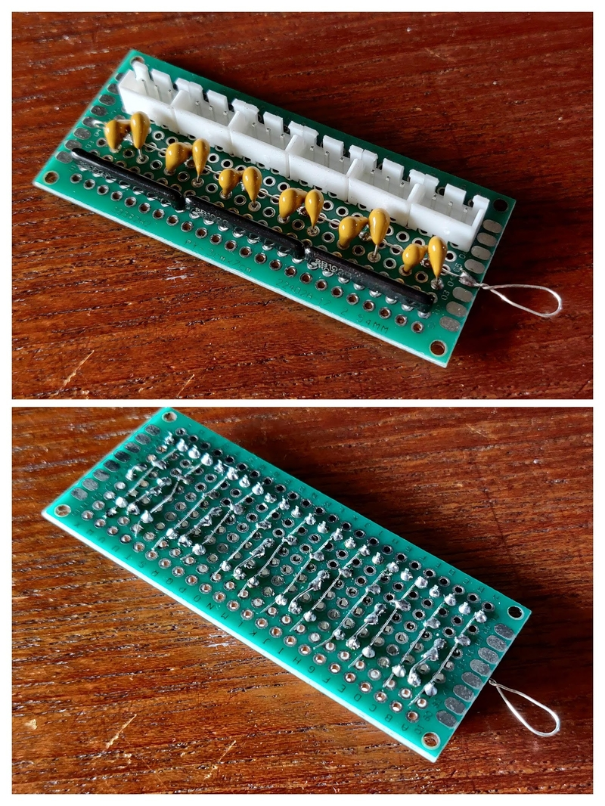

# LM1875 Amplifier

There are six stereo amplifiers to simulate six 400 Hz synchro or resolver transmitters

The input signals are generated by the RP2040 PWM system synchronised to the system 400 Hz power supply. 

Power is obtained from a 15 volt mains transformer feeding the onboard rectifiers.

Each channel output is protected agains amplifier failure by a DC blocking capacitor.

The PWM signals need to be filtered to remove the PWM switching frequency of approx 100kHz. A simple RC filter is used.

