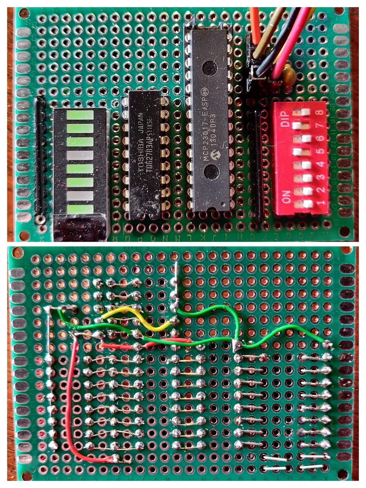

# Test program for MCP23017 with CYD

## datasheet

[Maxim MCP23017](../documents/20001952c.pdf)

[Toshiba TD62783AF](../documents/TD62783AF.pdf)

## software 

[MCP23017_WE Library](https://github.com/wollewald/MCP23017_WE/tree/master)

[Test program](src/CYD_MCP23017_I2C_input_output.cpp)

I2C address of the MCP23017 is the default 0x20 - all address pins low.

I2C output uses GPIO22 for I2C data MCP_SDA, and GPIO27 for I2C clock MCP_SCL

Although The MCP23017 has a reset input it is not used here (GPIO pin set to 99).

GPIO4 is set as output port and set to HIGH to turn off the Red LED. 

## test board

Inputs to port A switches to ground have 4k7 pull-up resistors to Vcc

Outputs on port B are buffered by high side driver IC, LEDs are fed through 220R current limited resistors to ground.

Note: circuit could be simplified by ommiting high side driver chip - I wanted to test its comppatibility here.

