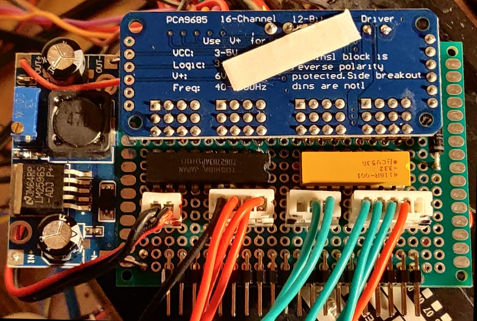

# PCA9685 16 Channel 12 Bit PWM

This board delivers 8 26 volt PWM for lamps and relays and 8 low current outputs for galvanometers.

The low current outputs are connected through limiting resistors. The high voltage outputs are connected through TD62783AP high side drivers 

An additional switching power supply board takes the 26 DC volt system power and regulates it down to 5 volts to power the other boards in the system, usually through their own 3v3 regulators.

### Board

### Weblink

[PCA9685 wiki](http://wiki.sunfounder.cc/index.php?title=PCA9685_16_Channel_12_Bit_PWM_Servo_Driver)

### Datasheets

[PCA9685 pdf](../documents/PCA9685.PDF)

[TD62783AF pdf](../documents/TD62783AF.pdf)

## normal configuration

|Channel|Sink         |               |    | |
|-------|-------------|---------------|----|-|
|    0  |DAC Galv Bias|5 volt analogue|5pin|HSI|
|    1  |DAC Galv1    |250 uA Analogue|5pin|HSI|
|    2  |DAC Galv2    |250 uA Analogue|5pin|HSI|
|    3  |DAC Galv3    |250 uA Analogue|5pin|HSI|
|    4  |unused       |               |
|    5  |DAC Flag1    |5 volt Switch  |3pin|HSI|
|    6  |DAC Flag2    |5 volt Switch  |3pin|HSI|
|       |             |               |    |
|    7  |DAC Relay    |28 V PWM       |    |unused|
|    8  |DAC Lamp     |28 V PWM       |4PIN|
|    9  |DAC Solenoid1|28 V Switch    |4PIN|
|   10  |DAC Solenoid2|28 V Switch    |4PIN|
|   11  |unused       |               |
|   12  |DAC DC1      |28 V PWM       |5PIN|M.Map Power|
|   13  |DAC DC2      |28 V PWM       |5PIN|M.Map DayNight|
|   14  |DAC DC3      |28 V PWM       |5PIN|M.Map Demo Bulb|
|       |             |               |    |               |
|   15  |DAC Amp      |28 V on/off    |2PIN|Amp-Relay|

