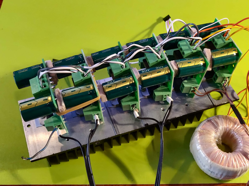

# TDA7294 Amplifier

These amplifiers are pairs of mono amp boards fed with the outputs of the six MAX532 MDAC chips. The 400Hz system supply is used as the input, control is by SPI from the RP2040. These are higher precision and have less phase jitter than the pwm channels. they are used for the moving map fine, medium, and coarse east west control channels.

Power is supplied by a 20-0-20 mains transformer, DC blocking capacitors are in series withthe outputs.

A potentiometer on the MDAC board sets the maximum output level.

