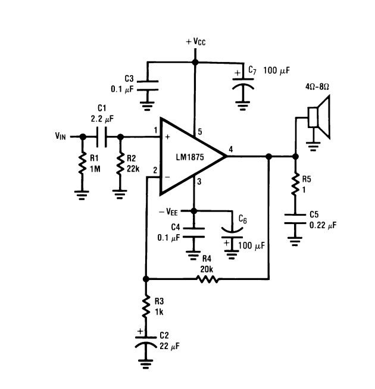
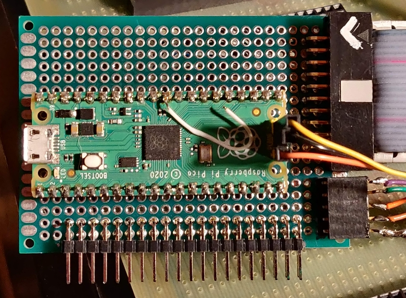
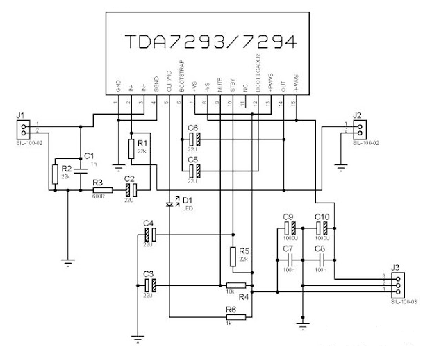

<table><tr>
<tr>
<td valign="bottom">
 
ADS1115-DAC.jpg
</td>

<td valign="bottom">
 
CombineFunction.png
</td>

<td valign="bottom">
 
DC-blocking-capacitors.jpg
</td>

<td valign="bottom">
 
DashboardCompassCard.png
</td>

</tr>
<tr>
<td valign="bottom">
 
DemoLHS.jpg
</td>

<td valign="bottom">
 
DemoRHS.jpg
</td>

<td valign="bottom">
 
H6_Horizon.jpg
</td>

<td valign="bottom">
 
HSI.jpg
</td>

</tr>
<tr>
<td valign="bottom">
 
HyperIMU_Flow.png
</td>

<td valign="bottom">
 
IMG_20230708_121225-COLLAGE_1024.jpg
</td>

<td valign="bottom">
 
IMG_20230801_204251.jpg
</td>

<td valign="bottom">
 
IMG_20230802_115135.jpg
</td>

</tr>
<tr>
<td valign="bottom">
 
IMG_20230802_123456.jpg
</td>

<td valign="bottom">
 
IMG_20230807_195858.jpg
</td>

<td valign="bottom">
 
IMG_20231025_192352.jpg
</td>

<td valign="bottom">
 
IMG_20231025_194250.jpg
</td>

</tr>
<tr>
<td valign="bottom">
 
IMU_Flow.png
</td>

<td valign="bottom">
 
LM1875-Amp.jpg
</td>

<td valign="bottom">
 
LM1875-Schematic.png
</td>

<td valign="bottom">
 
MAX532BipolarOperation.png
</td>

</tr>
<tr>
<td valign="bottom">
 
MAX532DaisyChain.png
</td>

<td valign="bottom">
 
MAX532ReferenceBuffer.jpg
</td>

<td valign="bottom">
 
MQTT_NodeRed.png
</td>

<td valign="bottom">
 
MX3aqjlUMAeUUY2H.png
</td>

</tr>
<tr>
<td valign="bottom">
 
OyH3q0k1a7W0Y7W8.png
</td>

<td valign="bottom">
 
PCA9685-PWM-Power.jpg
</td>

<td valign="bottom">
 
PWM-Filter.jpg
</td>

<td valign="bottom">
 
Pico-client-cpu.jpg
</td>

</tr>
<tr>
<td valign="bottom">
 
RMI.jpg
</td>

<td valign="bottom">
 
TDA7294-Schematic.png
</td>

<td valign="bottom">
 
TcMenuExample.jpg
</td>

<td valign="bottom">
 
WoVO8jZVJFkNUcRo.png
</td>

</tr>
<tr>
<td valign="bottom">
 
embedCONT.png
</td>

<td valign="bottom">
 
menu0001.png
</td>

<td valign="bottom">
 
menu_IMU_Pitch.png
</td>

<td valign="bottom">
 
menu_chan5.png
</td>

</tr>
<tr>
<td valign="bottom">
 
menu_chan8.png
</td>

<td valign="bottom">
 
tft_RoutingTable.png
</td>

<td valign="bottom">
 
tft_SynchroChannel.png
</td>

<td valign="bottom">
 
tft_screen_0.png
</td>

</tr>
<tr>
<td valign="bottom">
 
tft_screen_1.png
</td>

</tr></table>