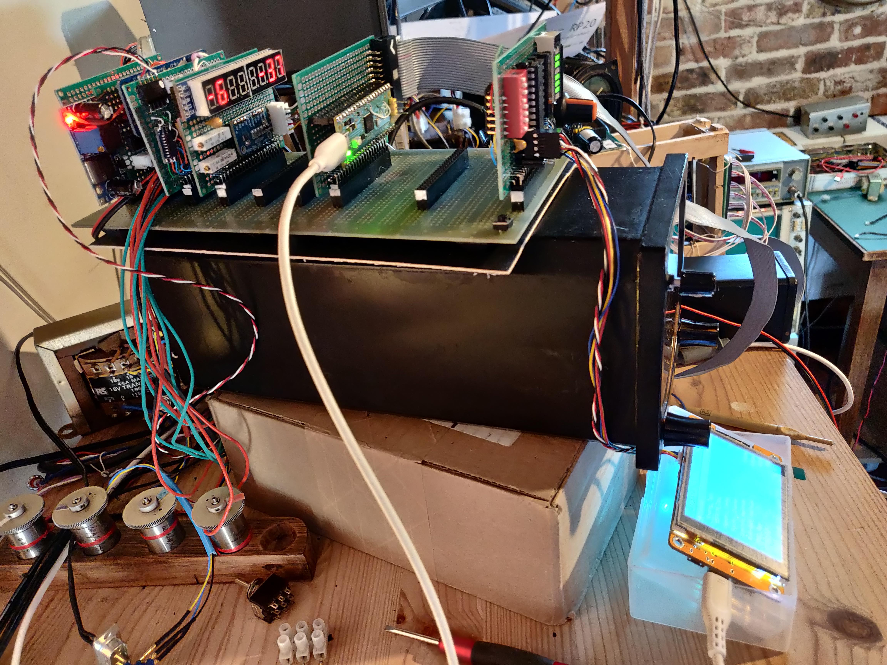
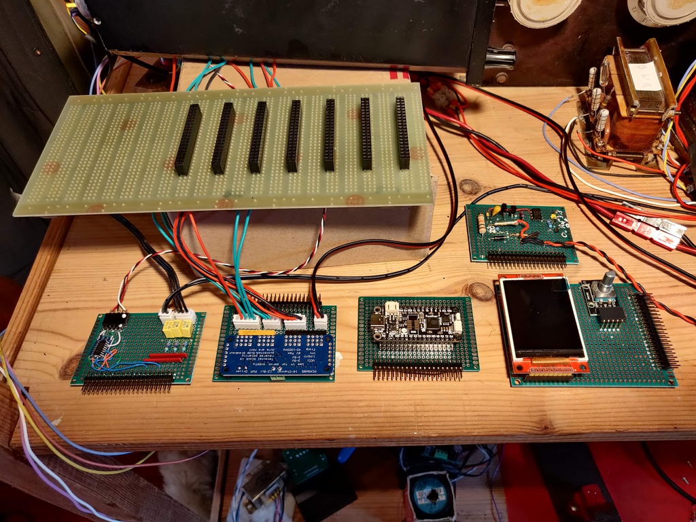
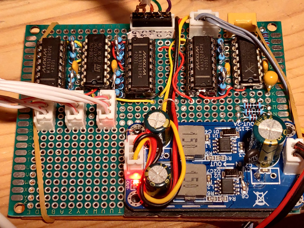

<table><tr>
<tr>
<td valign="bottom">
 
DemoLHS.jpg
</td>

<td valign="bottom">
 
DemoRHS.jpg
</td>

<td valign="bottom">
 
IMG_20230801_204251.jpg
</td>

<td valign="bottom">
 
IMG_20230802_115135.jpg
</td>

<td valign="bottom">
 
IMG_20230802_123456.jpg
</td>

</tr>
<tr>
<td valign="bottom">
 
IMG_20230807_195858.jpg
</td>

<td valign="bottom">
 
IMG_20231025_192352.jpg
</td>

<td valign="bottom">
 
IMG_20231025_194250.jpg
</td>

<td valign="bottom">
 
MAX532BipolarOperation.png
</td>

<td valign="bottom">
 
MAX532DaisyChain.png
</td>

</tr>
<tr>
<td valign="bottom">
 
MAX532ReferenceBuffer.jpg
</td>

<td valign="bottom">
 
MQTT_NodeRed.png
</td>

<td valign="bottom">
 
MX3aqjlUMAeUUY2H.png
</td>

<td valign="bottom">
 
OyH3q0k1a7W0Y7W8.png
</td>

<td valign="bottom">
 
TcMenuExample.jpg
</td>

</tr>
<tr>
<td valign="bottom">
 
WoVO8jZVJFkNUcRo.png
</td>

<td valign="bottom">
 
embedCONT.png
</td>

</tr></table>