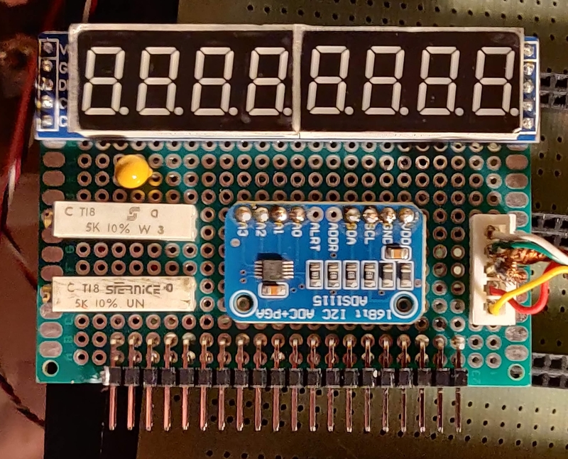

# Analogue to Digital converter, ADS1115

This board is used to measure the angles of the horizon gyro using two differential channel pairs connected to the servo potentiometers and a reference potentiometer on the circuit board.

## Datasheets

[ADS1115 dpf](../documents/ads1114.pdf)

[MAX7219 pdf](../documents/MAX7219-MAX7221.pdf)

## Weblinks

[ADS1115 breakout board](https://hobbycomponents.com/sensors/751-ads1115-i2c-16bit-adc-module)

[MAX7219 LED Display](https://hobbycomponents.com/displays/597-max7219-8-digit-seven-segment-display-module)

## Baord 

