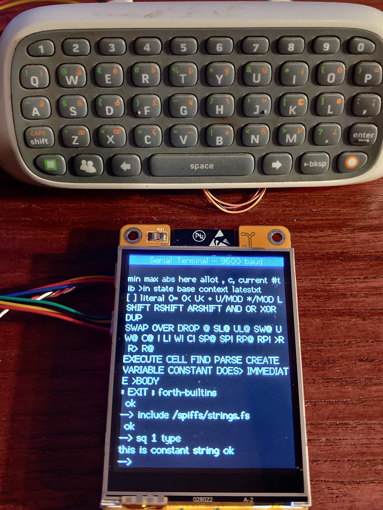

# Aviation Integrants - Forth system

The ESP32 Forth system has been incorporated into the Integrants software to provide a means to interactivly use a scripting and test facility. The Forth system runs in parallel with the existing software. The Forth system is a seperate component available to download from the website here: [https://esp32.arduino-forth.com/](https://esp32.arduino-forth.com/)

The system is initialised with a function call in the main program setup and a run task is called in the main program loop. Console I/O is performed by default to the USB serial console although this can be re-directed to a web or telnet client using the wifi connection.

Communicatrion with the Integrants system is through data sharing access functions accesible as Forth words, these words are in addition to the ones provided by the default Forth system. Additional word definitions can be held in the spiffs filing system.

## Forth data access functions

The data access funtions provided already are:

```
#include "src_menu.h"
extern void set_menuindex(int idx, float value);
extern float get_menuindex(int idx);
extern int values[16];
extern float fvalues[16];
extern int encoder_pos;
extern void CALLBACK_FUNCTION eeprom_load(int id);
```
These are used in the new Forth words:
```
#define USER_WORDS \
  Y(encoder, DUP; tos = (cell_t) & encoder_pos) \
  Y(eepromload, eeprom_load(0);) \
  Y(getmenuidx, *++fp = get_menuindex(n0); DROP) \
  Y(putmenuidx, set_menuindex(n0, *fp--); DROP) \
  Y(putvalue, values[n0]=n1; DROPn(2)) \
  Y(getvalue, n0=values[n0];) \
  Y(fgetvalue, *++fp = fvalues[n0]; DROP) \
  Y(fputvalue, fvalues[n0] = *fp--; DROP) \
```

Data is passed to and from the Integrants software as integer or floating point values. The getmenuidx and putmenuidx function give access to all the data sinks and sources available. it is also possible to re-load the saved eeprom contents, a future feature will be to allow saving of named eeprom data sets.

Additional Forth words have been created to read input from an attached serial keyboard and output the Forth console to the Integrants LCD display, this could provide a completely stand alone system if needed accessible by redirecting the USB console to the keyboard and LCD display.

The forth word setmenuidx takes two parameters one is the name of the value to change and the other is the data to send. A list of constants are defined to index the value names. Most of the values are set using floating point values, the index constants are integers. An example setting the moving map heading rotation to 30 degrees is:
``` 
30e Wheading putmenuidx
```
30e is the floating point angle to write to the heading value - putmenuidx takes the values and writes to the menu system source variable.

## Moving map demonstartion program

The initial demo function created drives the moving map display. The data access functions used drive the absolute map E/W position, the N/S position and the Heading angle. The test program loops through 360 degrees adding the sine and cosine to a base position and setting the heading to the angle of travel.

A set of constants are defined to set some of the program operating parameters and a constant used for conversion between degrees and radians, the listing with some comments is below:

```
\ **************************************************** 
\ moving map travel test
\ move map location around a circular path
\ heading adjusted to direction of travel
\ constants:
\ ab absolute value of map centre 
\ cd radius of circle travelled
\ dr degrees to radians conversion factor 360/pi
\ values:
\ lp step value of loop in degrees/10
\ ld loop delay value in mS
\ change value:
\ 10 to lp 
\ 1 to ld
\ disable resolver outputs:
\ ' vdummy to setNtoS
\ ' vdummy to setAbsolute
\ ' vdummy to setHeading 
\ start run using travel word, stops with key? press
\ **************************************************** 
DEFINED? --map-travel [if] forget --map-travel [then]
create --map-travel
57.29577951e fconstant dr
35e fconstant cd
705e fconstant ab
1 value lp
1 value ld
: vsetHeading -1e f* 90e  f+  Wheading putmenuidx ;
: vsetNtoS cd f* 90e f+ Wntos putmenuidx ;
: vsetAbsolute cd f* ab f+ Wabsolute putmenuidx ;
: vdummy f. ;
defer setHeading
defer setNtoS
defer setAbsolute
' vsetAbsolute is setAbsolute
' vsetHeading is setHeading
' vsetNtoS is setNtoS
: esc key? if key 27 = else 0 then ;
: travel 4501 900 do I dup S>F 10e f/ f. dup S>F 10e f/ setHeading S>F 10e f/ dr F/ fsincos setNtoS setAbsolute cr ld ms esc if leave then lp  +loop ; 
```

The program is stored in a file held in the spiffs filing system and can be loaded by using the include word, after loading the Forth word 'travel' runs the program.
```
include /spiffs/map-travel.fs
travel
```
There is an option to disable the writing of the heading information, this can be done without rebuildind by redirecting the setHeading word to do nothing or in this case to simply print the heading value to the terminal using the vdummy word lie this:
```
' vdummy to setHeading
travel
```
After which only the E/W and N/S changes are sent to the moving map when the demo is run
A video of the demo with and without the heading chages are shown in the links below:

[Moving map demo rotating](https://youtube.com/shorts/S2-Y6AIF72Y)

[Moving map demo upright](https://youtube.com/shorts/NiGAupk--6c)

## Serial keyboard and LCD terminal

Additional functions have been added to enable a small serial keyboard and the LCD screen to act as a terminal for the Forth system. 

Support words have been added to the Forth system to enable output to the tft display, these include:
```
  Y(tftsetup, setuptft();) \
  Y(tfttype, tftType(c1, n0); DROP) \
```
These are used in the simple serial terminal program shown below:
```
0 tftsetup
serial
9600 Serial2.begin

: tt-type tfttype drop ;
: s2-type serial Serial2.write drop ;
: s2-key? ( -- f ) serial Serial2.available 0<> pause ;
: s2-key ( -- ch ) begin s2-key? until 0 >r rp@ 1 serial Serial2.readBytes drop r> ;
: tt-on  ['] tt-type is type      ['] s2-key is key      ['] s2-key? is key? ;
: s2-on  ['] s2-type is type      ['] s2-key is key      ['] s2-key? is key? ;
: s2-off ['] default-type is type ['] default-key is key ['] default-key? is key? ;

s2-on
```
The console can be made to resume on the USB serial port by issuing the 's2-off' word




## Network access to Forth commands

<< WIP  >>


