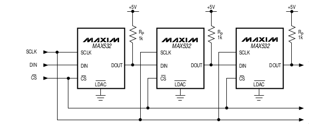
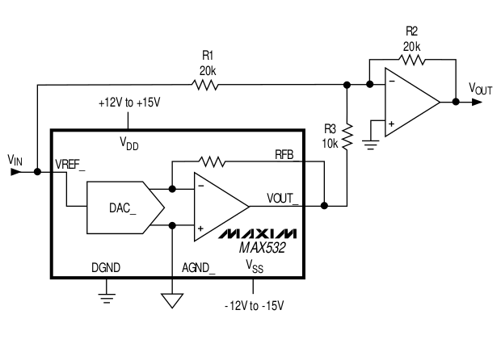
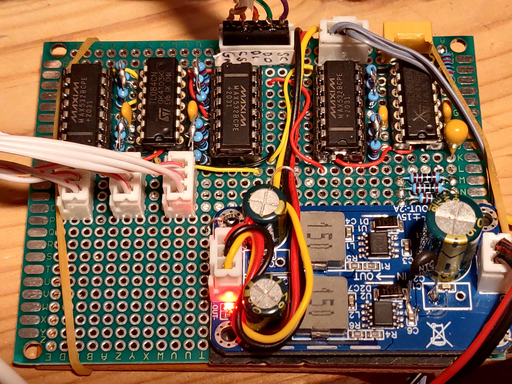
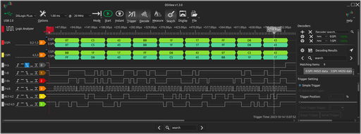
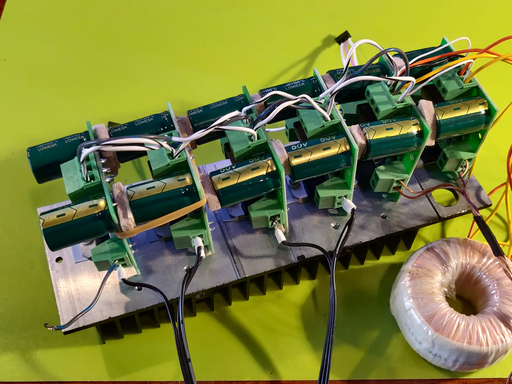

# MAX532 MDAC

The new circuits need +- 12 volts, this is provided by an inverter board powered from the system 26 volt supply - it could be obtained from the audio amplifier power supply. There is another small regulator under the board providing 3v3 for the data out pull-up resistors. n.b the data, select, and clock lines are interfaced with the pico operating at 3v3, I had thought a 3 to 5 volt level shifter might be needed but this has not been found to be so.






Here is a picture of the prototype MDAC board, it uses the bipolar configuration with an op-amp to shift the output into zero centred range as per the data sheet. The reference is buffered by another op-amp from one side of the same pair of signals feeding the MM display unit. Apart from the amplifier and output isolation capacitor everything is DC coupled.

### Prototype board



RP2040 communicates with the MAX532 chips using SPI protocol, a cingle chip enable is used to strobe all three signals together.

### Example Logic Analyser trace.

Logic analyser trace showing chip enable, clock, input, intermediate, and output signals.



### Six channel Output Amplifiers

The MDAC level shifting amplifiers drive the audio amplifiers, a pair of signals is needed to simulate a resolver



### SPI settings

```
#include <Arduino.h>
#include <SPI.h>
#include <stdint.h>

const int slaveSelectPin  = 13;
const int SPI1_MOSI       = 11;
const int SPI1_MISO       = 12;
const int SPI1_SCK        = 10;

SPISettings setMAX532(100000, MSBFIRST, SPI_MODE0);

uint16_t channel_A;
uint16_t channel_B;
uint16_t channel_C;
uint16_t channel_D;
uint16_t channel_E;
uint16_t channel_F;

void setup(void) {

  pinMode(slaveSelectPin, OUTPUT);
  SPI1.setSCK(SPI1_SCK);
  SPI1.setRX(SPI1_MISO);
  SPI1.setTX(SPI1_MOSI);
  SPI1.begin(false);

}
```

### SPI Writing

```
void SPI_write(void) 
{

  byte msg[9];

  channel_A = 0x100;
  channel_B = 0x400;
  channel_C = 0x789;
  channel_D = 0xABC;
  channel_E = 0xDEF;
  channel_F = 0x812;

  msg[0] = (byte) (   channel_B >> 4);
  msg[1] = (byte) ( ( channel_B << 4 ) | ( channel_A >> 8 ));
  msg[2] = (byte) (   channel_A & 0xFF);

  msg[3] = (byte) (   channel_D >> 4);
  msg[4] = (byte) ( ( channel_D << 4 ) | ( channel_C >> 8 ));
  msg[5] = (byte) (   channel_C & 0xFF);

  msg[6] = (byte) (   channel_F >> 4);
  msg[7] = (byte) ( ( channel_F << 4 ) | ( channel_E >> 8 ));
  msg[8] = (byte) (   channel_E & 0xFF);

  SPI1.beginTransaction(setMAX532);
  digitalWrite(slaveSelectPin, LOW);
  SPI1.transfer(msg, sizeof(msg));
  digitalWrite(slaveSelectPin, HIGH);
  SPI1.endTransaction();

}
```

