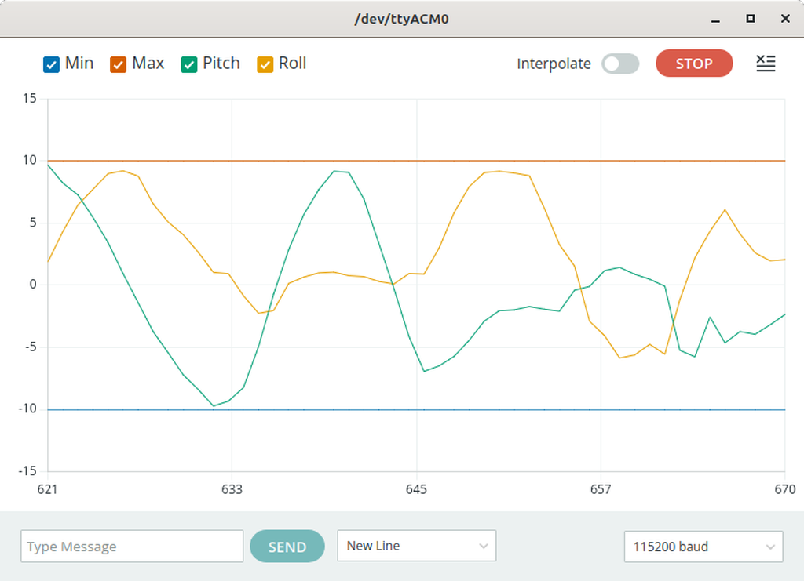

# HyperIMU demo

### HyperIMU is a mobile phone app to send sensor data from the phone to a network server
### This demo reads the data and plots pitch and roll on the arduino serial plotter 

## [Arduino apk](https://play.google.com/store/apps/details?id=com.ianovir.hyper_imu)

## [Pico-w software](./software/picow_hyperimu_plotter/picow_hyperimu_plotter.ino)

## Demo plot 

