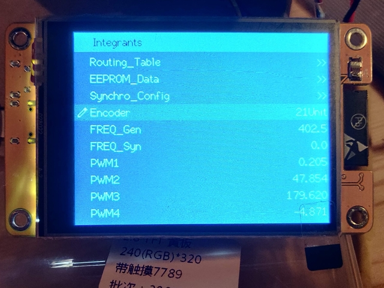
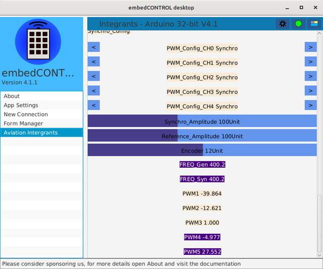

# djrm Aviation Integrants

### Dual processor Integrated master / client system

Master using ESP32 CYD tft touch display

[Integrants I2C master](./CYD_I2C_master)

Client using RP2040 PWM generators

[Integrants I2C client](./MULTI_I2C_client)

Latest version of sensor and driver software integration using TcMenu 

TcMenu remote control on PC using embedControl applicaton

## Physical

The system is powered from 28 volts DC which is used by the DAC output and a 5 volt regulator to supply the microcontrollers and peripheral devices.

PWM outputs are low voltage AC outputs which are fed into an array of audio amplifiers which are seperately powered from a 15-0-15 VAC mains transformer

An optional 115 Volt 400 Hz input is used to generate a synchronizing signal to the system synchro outputs. 

Operation without synchronising input is possible if the built-in reference generator is used and its output fed to the target system.

All system values are visible on the TFT menu display, the information is also transmitted as MQTT data and can de displayed on a PC using, for example, using Node Red dashboard or MQTT explorer.

The configuration menu is editable using the system rotary encoder, the menu protocol is accesible over wifi and also controllable using a PC application.
 

### Outputs

16 400 Hz variable purpose drives

16 DC DAC drives

8 LED Indicators

8 Digit 7 Segment display

### Inputs

Rotary encoder manual

28V 400Hz synchronizing input

ADC for horizon gyro

ADC for synchro reading

8 DIP switches

28 Volts DC Power for DAC outputs

### MQTT

#### Published

System status

PWM status

DIP switch status

LED status

#### Subscribed

HyperIMU phone position sensor

Angle inputs (0 to 4096)

Analogue inputs ( -180 to 180 )

Digital inputs ( 0 or 1 )

### Virtual I/O

#### Inputs

Items selectable in configuration menus

Angle inputs

Value inputs

Digital inputs

## PWM Configuration

There are 16 PWM channels normally arranged in pairs to drive amplifiers to simulate synchro or resolvers or other 400 Hz signals.

Each channel is configured using one of 12 parameter sets, giving access to:
 * Function
 * Data source
 * Rotation angle
 * Maximum amplitude
 
### Functions available

|Function |     |     |
|---------|-----|-----|
|Disabled |     |     |
|Synchro  |     |     |
|Resolver |     |     |
|Sine_ChA |     |     |
|Sine_ChB |     |     |
|Reference|     |     |

## Input sources

|Source |                   |
|-------|-------------------|
|Default|                   |
|ENCODER_Pos|               |
|FERQ_Gen|Internal frequency|
|FREQ_Syn|External frequency|
|ADC_Value1|Horizon Pitch   |
|ADC_Value2|Horizon Roll    |
|IMU_Pitch|HyperIMU         |
|IMU_Roll|HyperIMU          |
|IMU_Heading|HyperIMU       |
|DIP_SW1||
|DIP_SW2||
|DIP_SW3||
|DIP_SW4||
|DIP_SW5||
|DIP_SW6||
|DIP_SW7||
|DIP_SW8||
|MQTT_Value1|0 to 4096      |
|MQTT_Value2|               |
|MQTT_Value3|               |
|MQTT_Value4|               |
|MQTT_Value5|               |
|MQTT_Digit1|0 to 1         |
|MQTT_Digit2|               |
|MQTT_Digit3|               |
|MQTT_Digit4|               |
|MQTT_Digit5|               |
|MQTT_Digit6|               |
|MQTT_Digit7|               |
|MQTT_Digit8|               |
|EEP_Digit1|0 to 1 (0)      |
|EEP_Digit2|                |
|EEP_Digit3|                |
|EEP_Digit4|                |
|EEP_Digit5|                |
|EEP_Value1|0 to 4096 (2048)|
|EEP_Value2|                |
|EEP_Value3|                |
|EEP_Value4|                |
|EEP_Value5|                |
|EEP_Angle1|-180 to 180 (0) |
|EEP_Angle2|                |
|EEP_Angle3|                |
|EEP_Angle4|                |
|EEP_Angle5|                |
 
## Output sinks

|Sink         |               |
|-------------|---------------|
|PWM Chan0    |Pitch          |
|PWM1 Chan    |Roll           |
|PWM2 Chan    |Heading        |
|PWM3 Chan    |Reference      |
|PWM4 Chan    |               |
|PWM5 Chan    |               |
|PWM6 Chan    |spare          |
|PWM7 Chan    |spare          |
|PWM8 Chan    |spare          |
|PWM9 Chan    |spare          |
|PWM10 Chan   |also 7 Seg A   |
|PWM11 Chan   |also 7 Seg B   |
|DAC Galv1    |250 uA Analogue|
|DAC Galv2    |250 uA Analogue|
|DAC Galv3    |250 uA Analogue|
|DAC Flag1    |5 volt Switch  |
|DAC Flag2    |5 volt Switch  |
|DAC Relay    |28 V PWM       |
|DAC Lamp     |28 V PWM       |
|DAC Solenoid1|28 V Switch    |
|DAC Solenoid2|28 V Switch    |
|LED1         |               |
|LED2         |               |
|LED3         |               |
|LED4         |               |
|LED5         |               |
|LED6         |               |
|LED7         |               |
|LED8         |               |

